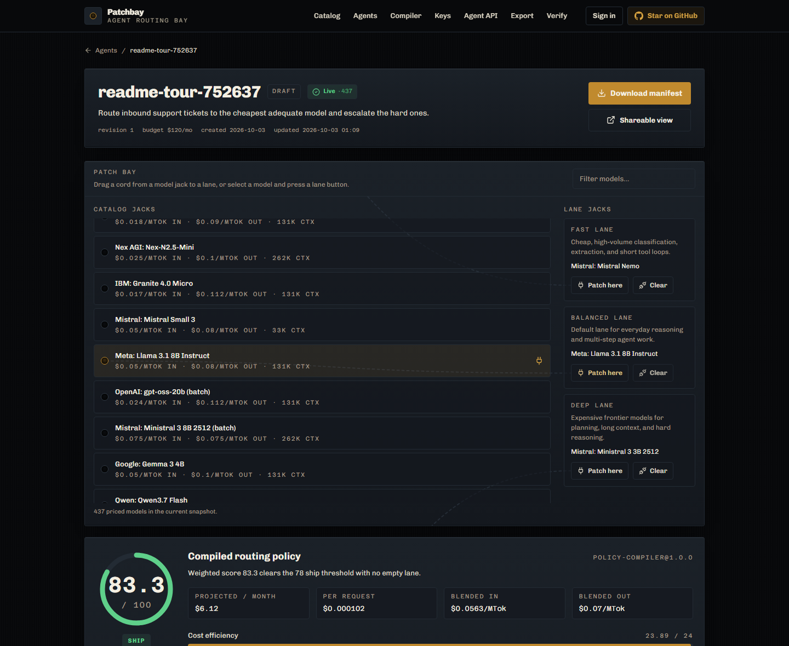
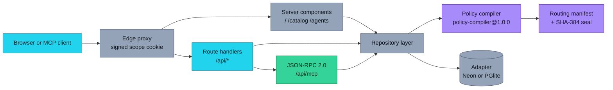
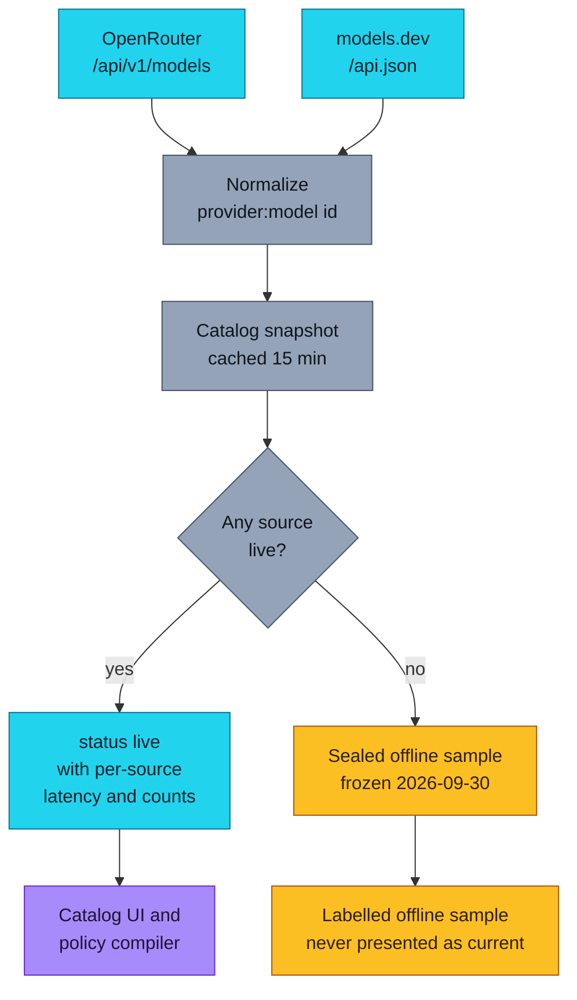
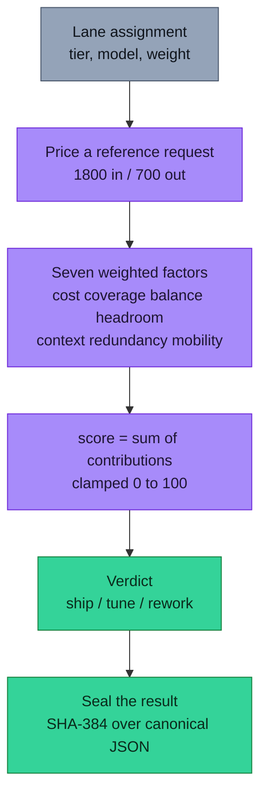
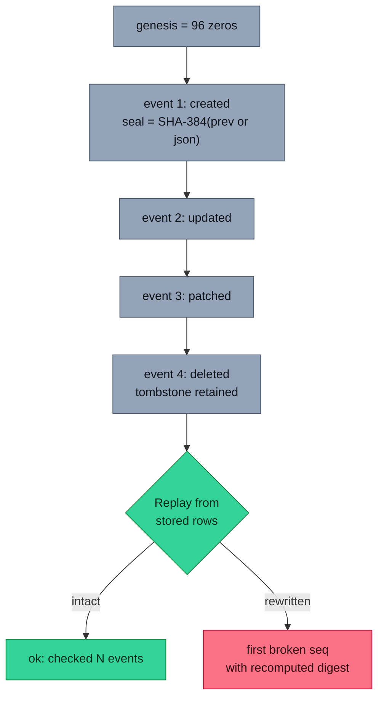
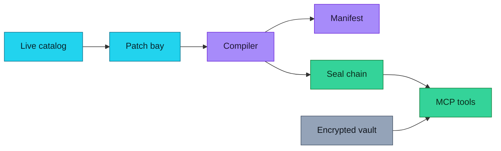
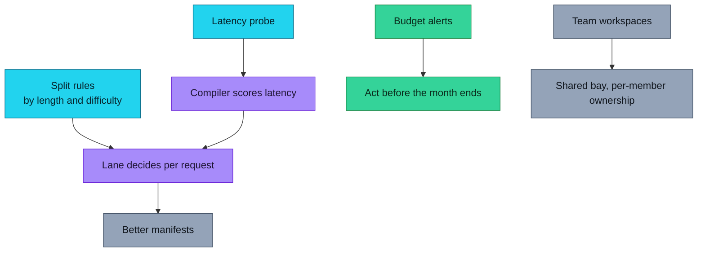
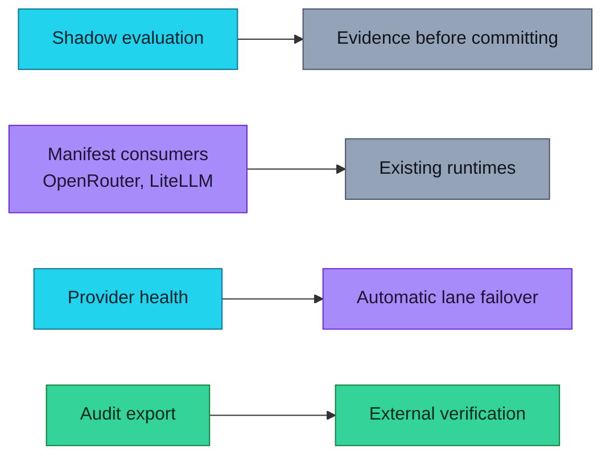

<div align="center">

# Patchbay

### Route every agent task to the model that should actually handle it.

[](https://patchbay-zeta.vercel.app)
[](LICENSE)
[](https://nextjs.org)
[](https://www.typescriptlang.org)
[](https://neon.tech)
[](https://openrouter.ai/api/v1/models)
[](public/mcp.json)

**[Live App](https://patchbay-zeta.vercel.app)** · **[Source](https://github.com/aniruddhaadak80/patchbay)** · **[API](https://patchbay-zeta.vercel.app/api/health)** · **[Agent Tools](https://patchbay-zeta.vercel.app/agent)** · **[Issues](https://github.com/aniruddhaadak80/patchbay/issues)**

</div>

---

Most agent setups send everything to one model. Patchbay is a **routing patchbay**: you
patch models onto `fast`, `balanced`, and `deep` lanes, and a deterministic compiler scores
the policy out of 100 using seven weighted factors — then you export a sealed manifest
you own.

- **Real prices, live.** Normalized from [OpenRouter](https://openrouter.ai/api/v1/models)
  and [models.dev](https://models.dev/api.json). Per-million input/output cost, context
  windows, and capabilities, with per-source attribution and a `live` / `fallback` label.
- **Your keys stay yours.** Provider keys are sealed with AES-256-GCM before they touch
  the database and are never returned by any read endpoint.
- **Every mutation is provable.** Each agent carries a per-entity SHA-384 hash chain,
  and replay reports the first broken link.
- **An agent interface, not a chat box.** Eight MCP-style JSON-RPC tools with read,
  analysis, and mutating paths that share the UI's service layer.

## ✨ Features

| Outcome you get | How |
| --- | --- |
| **Stop overpaying for easy tasks** | Patch a cheap classifier and a frontier model onto separate lanes, then read the real monthly projection. |
| **Catch a bad policy before it bills you** | `policy-compiler@1.0.0` returns a score, itemized factor contributions, and warnings like *"Projected $412/month exceeds the $120 ceiling."* |
| **Prove nothing was rewritten** | Replay recomputes every seal from stored rows alone and names the first broken sequence number. |
| **Keep provider keys under your control** | Store them encrypted; read paths return a label, last four characters, and a fingerprint. |
| **Drive it from your own assistant** | Point an MCP client at `/api/mcp` and let it read the catalog, compile policies, and patch lanes. |
| **Take the setup with you** | Download a routing manifest with lanes, score, factors, provenance, and seals as JSON or a lane CSV. |

## 🚀 Quickstart

```bash
git clone https://github.com/aniruddhaadak80/patchbay.git
cd patchbay
npm ci
npm run dev
```

Open <http://localhost:3000>. **No environment variables are required.** Without
`DATABASE_URL` the app runs on an embedded Postgres (PGlite) persisted in
`.patchbay/pglite`, and the catalog serves a sealed offline sample when the upstreams are
unreachable.

### Scripts

| Command | What it does |
| --- | --- |
| `npm run dev` | Development server |
| `npm run typecheck` | `tsc --noEmit` |
| `npm run lint` | ESLint |
| `npm run test` | Vitest unit tests |
| `npm run build` | Production build |
| `npm run test:browser` | Playwright journey on desktop, plus layout, navigation, validation and focus checks on mobile |
| `npm run db:migrate` | Apply migrations explicitly (they also run on cold start) |
| `npm run verify:live` | Full HTTP proof against a deployment (`PATCHBAY_BASE_URL=…`) |

### Production environment

Copy `.env.example` to `.env.local`. Only two variables matter:

| Variable | Required | Purpose |
| --- | --- | --- |
| `DATABASE_URL` | Yes | Hosted Postgres connection string. The app refuses production traffic from the embedded adapter on a serverless host. |
| `AUTH_SECRET` | Yes | Signs the anonymous scope cookie and, by default, encrypts stored provider keys. `openssl rand -base64 32`. |
| `CREDENTIAL_ENCRYPTION_KEY` | No | Dedicated key-encryption secret. Rotating it makes stored keys unreadable. |
| `NEXT_PUBLIC_SITE_URL` | Yes | Absolute origin for metadata and Better Auth trusted origins. |
| `TRUSTED_ORIGINS` | No | Extra origins, comma separated, for preview deployments. |

Schema creation is idempotent and runs on cold start, so a fresh deploy needs no manual
migration step.

## 📸 Product tour



*The agent page: live catalog jacks on the left, three tier lanes on the right, and the
compiled policy with its itemized factors and seal.*

## 🗺️ How it works

### System architecture



### Data pipeline and honest fallback



### Deterministic policy compiler



Weights: cost 24, coverage 18, balance 16, headroom 14, context 12, redundancy 10,
mobility 6. Full rationale is in `src/lib/engine.ts` and on `/compile`.

### Agent sequence

```mermaid
graph LR
  Client["MCP client"] --> Init["initialize<br/>protocolVersion, serverInfo"]
  Init --> List["tools/list<br/>eight typed schemas"]
  List --> Read["list_models<br/>read tool"]
  Read --> Score["compile_policy<br/>analysis tool"]
  Score --> Write["upsert_agent<br/>mutating tool"]
  Write --> Same["Same service layer<br/>as the UI"]
  Same --> Verify["verify_integrity<br/>replay the chain"]

  classDef live fill:#22d3ee,color:#06222a,stroke:#0e7490
  classDef agent fill:#34d399,color:#0a2a1b,stroke:#15803d
  classDef engine fill:#a78bfa,color:#1e1533,stroke:#6d28d9
  classDef infra fill:#94a3b8,color:#10151c,stroke:#475569

  class Init,List,Read live
  class Write,Same,Verify agent
  class Score engine
  class Client infra
```



### Integrity and seal replay



### User journey

```mermaid
graph LR
  Land["/"] --> New["/agents/new"]
  New --> Detail["/agents/id<br/>patch a lane"]
  Detail --> Compile["/compile<br/>read the factors"]
  Compile --> Console["/agent<br/>drive over JSON-RPC"]
  Console --> Verify["/verify<br/>replay the chain"]
  Verify --> Desk["/export<br/>download the manifest"]

  classDef live fill:#22d3ee,color:#06222a,stroke:#0e7490
  classDef engine fill:#a78bfa,color:#1e1533,stroke:#6d28d9
  classDef agent fill:#34d399,color:#0a2a1b,stroke:#15803d
  classDef infra fill:#94a3b8,color:#10151c,stroke:#475569

  class Land,Detail,Desk live
  class Compile engine
  class Console,Verify agent
  class New infra
```



## 🔌 API

Errors share one envelope: `{ "error": { "code", "message", "details?" } }`.

### Create, then read back

```bash
BASE=http://localhost:3000

# What can we route to?
curl -s "$BASE/api/catalog?limit=3&capability=tools" | jq '.data.models[].id'

# Create a policy
curl -s -X POST "$BASE/api/agents" \
  -H 'content-type: application/json' \
  -H "idempotency-key: $(uuidgen)" \
  -d '{
    "name": "ticket-router",
    "taskClass": "Route inbound support tickets to the cheapest adequate model.",
    "budgetUsd": 300,
    "lanes": {
      "fast":     { "modelId": "provider:cheap", "weight": 0.6, "dailyRequests": 1200 },
      "balanced": { "modelId": "provider:mid",   "weight": 0.3, "dailyRequests": 500 },
      "deep":     { "modelId": "provider:heavy", "weight": 0.1, "dailyRequests": 100 }
    }
  }' | jq '{id: .data.agent.id, score: .data.compiled.score, verdict: .data.compiled.verdict}'

# Read it back
curl -s "$BASE/api/agents/<id>" | jq '.data.agent.lanes'

# Patch one lane, guarding against a lost update
curl -s -X PATCH "$BASE/api/agents/<id>" \
  -H 'content-type: application/json' \
  -d '{"lanes":{"deep":{"modelId":null}},"expectedRevision":1}' | jq '.data.agent.revision'
```

### Compile a policy

```bash
curl -s -X POST "$BASE/api/compile" \
  -H 'content-type: application/json' \
  -d '{"agentId":"<id>","dailyRequests":4000}' \
  | jq '.data.compiled | {engineVersion, score, verdict, projectedMonthlyUsd, warnings}'
```

### Verify and delete

```bash
curl -s "$BASE/api/verify?agentId=<id>" | jq '.data | {ok, checked, headSeal}'
curl -s -X DELETE "$BASE/api/agents/<id>" | jq '.data | {deleted, tombstone}'
```

### Credentials

```bash
curl -s -X POST "$BASE/api/credentials" \
  -H 'content-type: application/json' \
  -d '{"provider":"openai","label":"work key","secret":"sk-..."}' \
  | jq '.data.credential | {provider, last4, fingerprint, keyValueReturned}'
```

The response never contains the key. It returns `keyValueReturned: false`.

### Full endpoint list

| Method | Path | Purpose |
| --- | --- | --- |
| `GET` | `/api/health` | Real write/read/delete round trip plus adapter state |
| `GET` | `/api/catalog` | Normalized catalog with provenance; filter by `q`, `provider`, `capability`, `maxInput`, `limit` |
| `POST` | `/api/catalog` | Bypass the cache and refresh the feed |
| `GET` `POST` | `/api/agents` | List (filter by `status`, `q`) and create |
| `GET` `PATCH` `DELETE` | `/api/agents/[id]` | Read, update, soft-delete |
| `GET` | `/api/agents/[id]/export` | Downloadable routing manifest |
| `POST` | `/api/compile` | Score a stored agent or an inline lane board |
| `GET` `POST` `DELETE` | `/api/credentials` | Encrypted BYOK vault |
| `GET` | `/api/verify` | Replay every chain, or one by `agentId` |
| `GET` `POST` | `/api/mcp` | MCP-style JSON-RPC 2.0 |
| `POST` | `/api/session/adopt` | Move anonymous records into a new account |
| `*` | `/api/auth/*` | Better Auth (email and password) |

## 🤖 Agent interface

```json
{
  "mcpServers": {
    "patchbay": {
      "type": "http",
      "url": "https://patchbay-zeta.vercel.app/api/mcp"
    }
  }
}
```

`public/mcp.json` ships the same registration for MCP directories.

| Tool | Kind | What it does |
| --- | --- | --- |
| `list_models` | read | Normalized catalog with prices, context, capabilities, provenance |
| `list_agents` | read | Your agents, newest first |
| `get_agent` | read | One agent with a freshly compiled result |
| `upsert_agent` | mutate | Create or patch lanes; honours `Idempotency-Key` |
| `delete_agent` | mutate | Soft delete, retaining a replayable tombstone |
| `compile_policy` | analysis | Versioned score with weighted factors and a seal |
| `verify_integrity` | read | Replay chains and report the first broken link |
| `export_agent` | read | The portable routing manifest |

```bash
curl -s -X POST https://patchbay-zeta.vercel.app/api/mcp \
  -H 'content-type: application/json' \
  -d '{"jsonrpc":"2.0","id":1,"method":"tools/call",
       "params":{"name":"list_models","arguments":{"limit":3}}}' | jq '.result.structuredContent.models'
```

## 📁 Project map

### User routes

| Route | Goal | States |
| --- | --- | --- |
| `/` | Understand the product and start an agent | Live rack readout, honest catalog status |
| `/catalog` | Browse live models and their provenance | `live` / `offline sample`, per-source status, capability coverage |
| `/agents` | Every policy, filterable in the URL | Filter, search, empty, bounded list |
| `/agents/new` | Create a policy | Validation, conflict on duplicate name, catalog-backed selects |
| `/agents/[id]` | Inspect, patch, compile, verify, delete | Patch bay, live score, audit chain, 409 on stale revision |
| `/compile` | Score a stored agent or an inline board | Versioned result, factor bars, warnings, per-lane recommendation |
| `/keys` | Encrypted BYOK vault | Format validation, masked list, delete, encryption explainer |
| `/agent` | Live JSON-RPC console | Preset calls, visible request and response, real errors |
| `/export` | Build the takeaway artifact | JSON download, lane CSV, manifest preview |
| `/verify` | Replay every seal chain | Per-chain verdict with head seal and break point |
| `/share/[id]` | Public read-only policy view | Score, factors, manifest, no owner notes |
| `/sign-in` | Optional account, adopts anonymous work | Create, sign in, adoption result |

### API routes

| Path | Responsibility |
| --- | --- |
| `src/app/api/health/route.ts` | Live persistence round trip and adapter safety state |
| `src/app/api/catalog/route.ts` | Catalog read, filters, cache bypass |
| `src/app/api/agents/route.ts` | List and create with catalog validation |
| `src/app/api/agents/[id]/route.ts` | Read, update with revision guard, soft delete |
| `src/app/api/agents/[id]/export/route.ts` | Attachment manifest download |
| `src/app/api/compile/route.ts` | Stored or inline policy compilation |
| `src/app/api/credentials/route.ts` | Encrypted credential CRUD |
| `src/app/api/verify/route.ts` | Seal replay |
| `src/app/api/mcp/route.ts` | JSON-RPC 2.0 and the eight tools |
| `src/app/api/session/adopt/route.ts` | Anonymous-to-account adoption |
| `src/app/api/auth/[...all]/route.ts` | Better Auth handler |

### Core modules

| Path | Responsibility |
| --- | --- |
| `src/lib/engine.ts` | `policy-compiler@1.0.0`, the seven weighted factors |
| `src/lib/seal.ts` | Canonical JSON, SHA-384 chain, replay |
| `src/lib/manifest.ts` | The portable routing manifest |
| `src/lib/catalog.ts` | Fetch, normalize, merge, fallback labelling |
| `src/lib/vault.ts` | AES-256-GCM sealing and format validation |
| `src/lib/scope.ts` | Signed anonymous scope cookie |
| `src/lib/api.ts` | Zod schemas, error envelopes, write throttle |
| `src/lib/db/client.ts` | Adapter selection, Neon and PGlite clients, migrations |
| `src/lib/db/repository.ts` | Every query, ownership-scoped |
| `src/lib/db/adopt.ts` | Anonymous-to-account record migration |
| `src/lib/site.ts` | Single source of truth for links and metadata |
| `scripts/verify-live.mjs` | Live end-to-end proof |
| `scripts/migrate.mjs` | Explicit migration runner |

## 🔐 Security model

- **Credential encryption.** AES-256-GCM, random 12-byte IV per record, auth tag
  stored with the ciphertext so tampering fails closed. Key derived with SHA-256 from
  `CREDENTIAL_ENCRYPTION_KEY`, falling back to `AUTH_SECRET`. Rotating either value
  destroys stored keys.
- **No secret in a read path.** Only a label, last four characters, and a SHA-256
  fingerprint of the ciphertext are ever returned. Exports omit credentials entirely.
- **Signed ownership.** Anonymous scopes use an HMAC-SHA256 signed, HTTP-only cookie,
  verified with a constant-time compare and never accepted from a query string.
- **Owner-scoped SQL.** Every read and write filters by owner id. Cross-session reads
  return 404 rather than 403, so existence is not leaked.
- **Validated input.** Model ids reject `..` and trailing slashes; strings have length
  caps; enums are closed; queries are parameterized.
- **Truthful errors.** Stable codes and messages. No stack traces, SQL, or environment
  values in responses.

### Abuse controls, honestly

Write throttling is an in-process counter: 120 writes per minute per scope. On serverless
that is per-instance and resets on cold start, so it is a courtesy brake rather than a
guarantee. A high-traffic deployment should put a hosted limiter in front of the write
endpoints. Anonymous scopes are not accounts until someone signs up, and clearing
cookies means losing access to anonymous work.

## 🗄️ Data provenance

| Source | Used for | Endpoint |
| --- | --- | --- |
| [OpenRouter](https://openrouter.ai/api/v1/models) | Per-token prices, context length, modalities | Public, no key |
| [models.dev](https://models.dev/api.json) | Capability flags, release dates, open-weight status | Public, no key |

Both are fetched with a 6-second timeout, cached in-process for 15 minutes, and reported
per source with fetch time, record count, and a sample upstream id. When both fail, the
app serves a sealed offline sample frozen on 2026-09-30 and labels it `fallback` on every
surface. Prices are reference data, not quotes.

## 🗺️ Roadmap

### Now

- [x] Live catalog merged from two public upstreams with honest fallback
- [x] Deterministic seven-factor policy compiler with itemized contributions
- [x] Patchbay interaction: patch a model onto a lane and watch the score recompute
- [x] Per-agent SHA-384 seal chain with replay and a public verify route
- [x] MCP-style JSON-RPC 2.0 with eight tools, including mutating paths
- [x] Encrypted BYOK vault with no secret in any read path
- [x] Routing manifest export as JSON and lane CSV



### Next

- [ ] **Latency probe** — measure real time-to-first-token per patched model so the
  compiler can score latency instead of estimating it.
- [ ] **Traffic splitting rules** — route by task length or estimated difficulty so a
  lane decides where a request goes, not just which model serves it.
- [ ] **Budget alerts** — notify when projected spend crosses a fraction of the ceiling,
  before the month ends.
- [ ] **Team workspaces** — share a patchbay across an organization with per-member
  ownership of the lanes they patch.



### Later

- [ ] **Shadow evaluation** — run candidate lane assignments against a sample of real
  prompts and compare outcomes before committing to them.
- [ ] **Manifest consumers** — first-class adapters that turn a manifest into an
  OpenRouter, LiteLLM, or OpenAI-compatible client configuration.
- [ ] **Provider health signals** — route around an outage instead of discovering it
  in your logs.
- [ ] **Audit export** — hand the whole chain to an external verifier.



## Deployment

The app runs anywhere Node 20.9+ runs.

- **Vercel.** Connect the repository, set `DATABASE_URL`, `AUTH_SECRET`, and
  `NEXT_PUBLIC_SITE_URL`, deploy. Schema creation runs on first request.
- **Any Node host.** `npm run build && npm start`. Without `DATABASE_URL` the embedded
  adapter runs, which suits a single machine but loses data on redeploy — the app tells
  you this at boot rather than failing silently.

The app refuses to serve production traffic from the embedded adapter on a serverless
host, because cold starts would discard it.

## 🤝 Contributing

Issues and pull requests are welcome. Read [CONTRIBUTING.md](CONTRIBUTING.md) first: it
documents where the engine, seal chain, and repository layer live, and the conventions
that keep the UI, the REST API, and the MCP tools from disagreeing.

Security problems go to [SECURITY.md](SECURITY.md), not the issue tracker.

## License

[MIT](LICENSE) © 2026 aniruddhaadak80

Data courtesy of [OpenRouter](https://openrouter.ai) and [models.dev](https://models.dev).
Both are independent projects; Patchbay is not affiliated with either.
